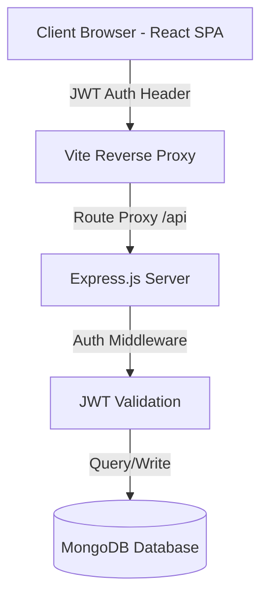

# 📄 InVoiceGen - Premium Invoice Management System

[](https://react.dev/)
[](https://vite.dev/)
[](https://tailwindcss.com/)
[](https://nodejs.org/)
[](https://www.mongodb.com/)

A modern, high-performance, and fully responsive invoice generation and tracking platform. Designed with premium aesthetics, rich micro-animations, glassmorphism, and print-optimized views to make invoicing clean, fast, and professional.

---

## 🚀 Key Features

*   **📊 Rich Dashboard Analytics:** Track estimated revenue, total active invoices, pending payments, and successful client transfers instantly.
*   **✍️ Dynamic Invoice Builder:** Interactive editor featuring state reducers to easily add line items, unit rates, custom tax configurations, currencies, and discounts.
*   **📥 PDF Generation & Downloads:** Export beautiful invoices locally using `html2canvas` and `jsPDF`.
*   **🖨️ Physical Print Optimization:** Automatically hides sidebars, headers, and UI widgets to render a perfect physical layout during printing.
*   **🔗 Secure Public View Sharing:** Share a safe, secure public link with clients to view their invoices online.
*   **⚙️ Business Settings Manager:** Customize your business name, contact info, address, tax ID, and upload logos (stored as Base64 images) persisted across devices.
*   **🔒 Session-Managed JWT Auth:** Encrypted password hashing using `bcryptjs` and session-safe route protection using JSON Web Tokens (JWT).

---

## 🛠️ System Architecture



---

## 📂 Project Structure

```text
InVoiceGen/
├── backend/                  # Node.js + Express Server
│   ├── src/
│   │   ├── config/           # Database Connection (Mongoose)
│   │   ├── middleware/       # JWT Authorization Middleware
│   │   ├── models/           # Schemas (User, Settings, Invoice)
│   │   ├── routes/           # REST APIs (Auth, Invoices, Settings)
│   │   └── server.js         # Backend Entry Point
│   └── package.json
└── frontend/                 # Vite + React 19 Client
    ├── src/
    │   ├── components/       # Reusable UI Blocks (Buttons, Badges, Modals)
    │   ├── contexts/         # React Contexts (AuthProvider)
    │   ├── pages/            # Core Views (Dashboard, Forms, Preview, Settings)
    │   ├── services/         # Axios API Integration
    │   ├── utils/            # Calculations and Reducer Helpers
    │   └── main.jsx          # Frontend Entry Point
    └── package.json
```

---

## ⚙️ Getting Started

### 📋 Prerequisites

Make sure you have the following installed on your machine:
*   [Node.js](https://nodejs.org/) (v18.0.0 or higher)
*   [MongoDB](https://www.mongodb.com/try/download/community) (Running locally or using MongoDB Atlas)
*   [Git](https://git-scm.com/)

---

### 1️⃣ Database Setup
Ensure MongoDB is running locally on your machine:
```powershell
# On Windows, verify service status:
Get-Service -Name MongoDB
```
Or start MongoDB manually on port `27017`.

---

### 2️⃣ Backend Configuration & Startup

1.  Navigate to the `/backend` folder:
    ```bash
    cd backend
    ```
2.  Copy `.env.example` to create your own configuration file:
    ```bash
    cp .env.example .env
    ```
3.  Install dependencies:
    ```bash
    npm install
    ```
4.  Launch the development server:
    ```bash
    npm run dev
    ```

The backend server will launch on `http://localhost:5000`.

---

### 3️⃣ Frontend Configuration & Startup

1.  Navigate to the `/frontend` folder:
    ```bash
    cd ../frontend
    ```
2.  Install dependencies:
    ```bash
    npm install
    ```
3.  Launch the Vite development server:
    ```bash
    npm run dev
    ```

Open your browser and navigate to **`http://localhost:5173`**.

---

## 📡 API Reference

| Endpoint | Method | Description | Auth Required |
| :--- | :--- | :--- | :--- |
| `/api/auth/register` | `POST` | Register a new user account | ❌ No |
| `/api/auth/login` | `POST` | Log in and receive JWT session token | ❌ No |
| `/api/invoices` | `GET` | Get all invoices for the authenticated user | 🔐 Yes (JWT) |
| `/api/invoices` | `POST` | Create a new invoice | 🔐 Yes (JWT) |
| `/api/invoices/:id` | `GET` | Fetch specific invoice details | ❌ (Public if shared) |
| `/api/invoices/:id` | `PUT` | Update status or details of an invoice | 🔐 Yes (JWT) |
| `/api/invoices/:id` | `DELETE`| Remove an invoice | 🔐 Yes (JWT) |
| `/api/settings` | `GET` | Retrieve saved business settings | 🔐 Yes (JWT) |
| `/api/settings` | `POST` | Create or update business profile details | 🔐 Yes (JWT) |

---

## 🧪 License & Contributions
Contributions are welcome! Please open an issue or submit a pull request for any design improvements or additional features.

Distributed under the MIT License. See `LICENSE` for more information.
